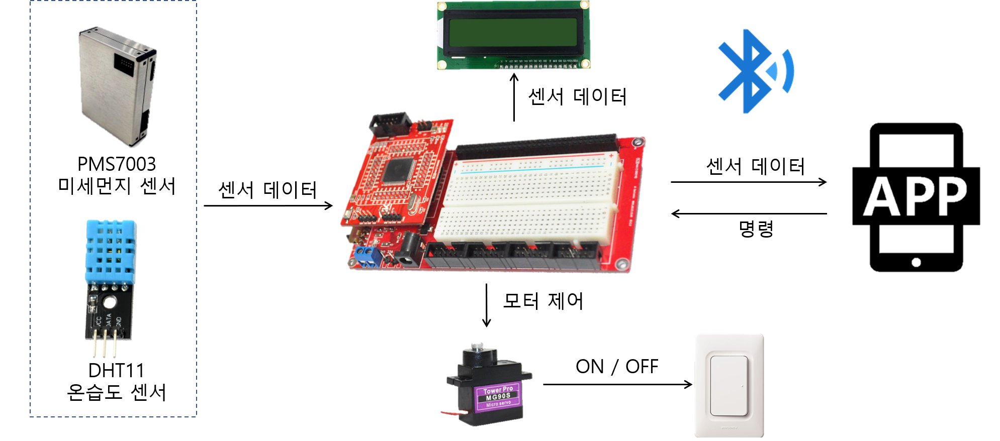
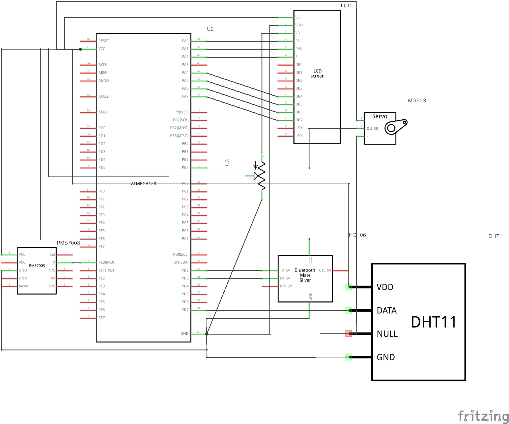
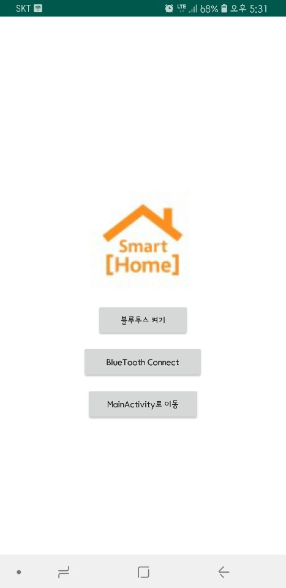
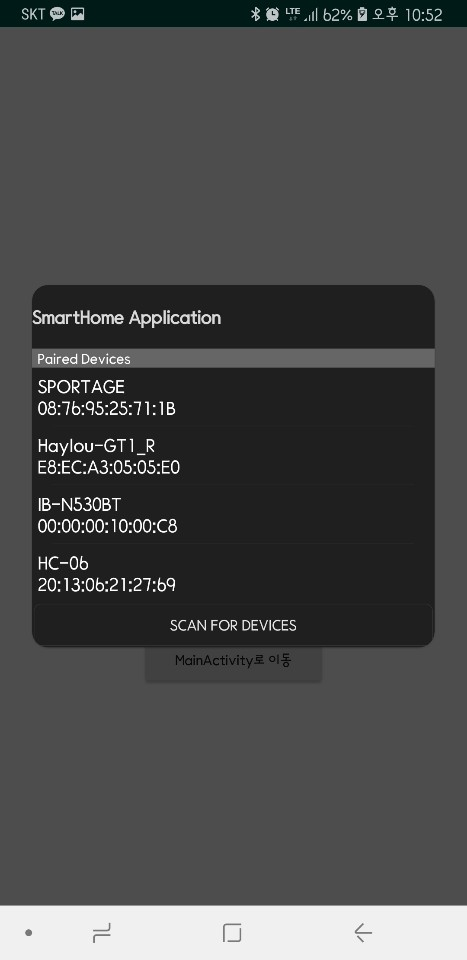
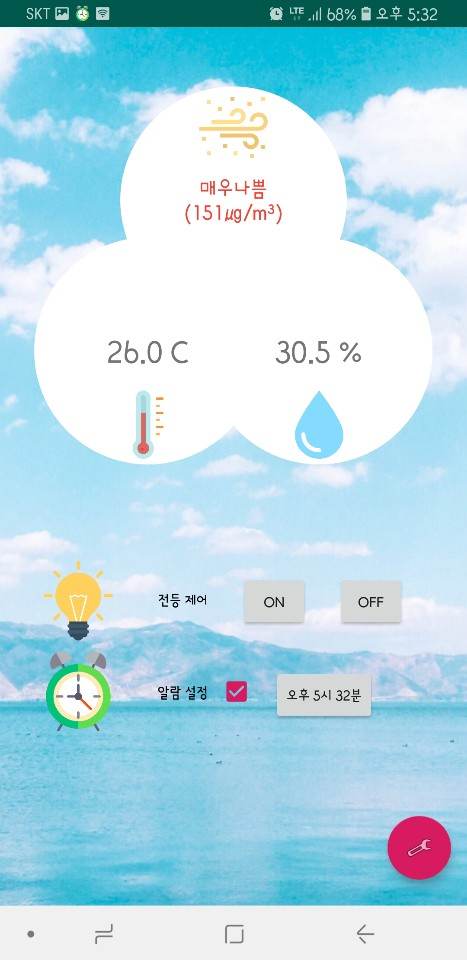
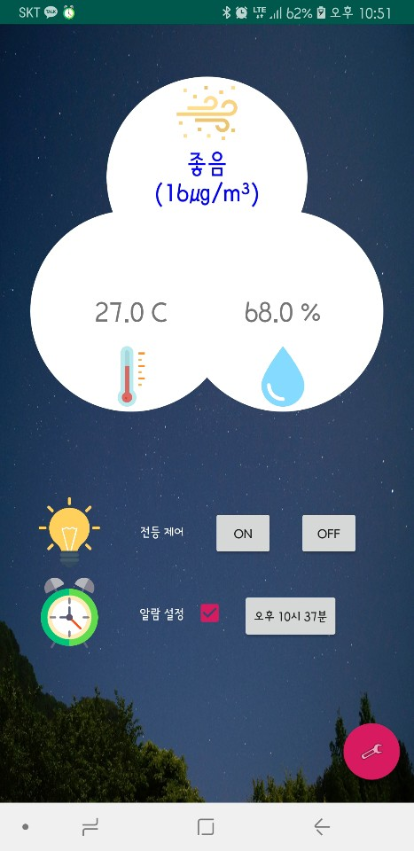
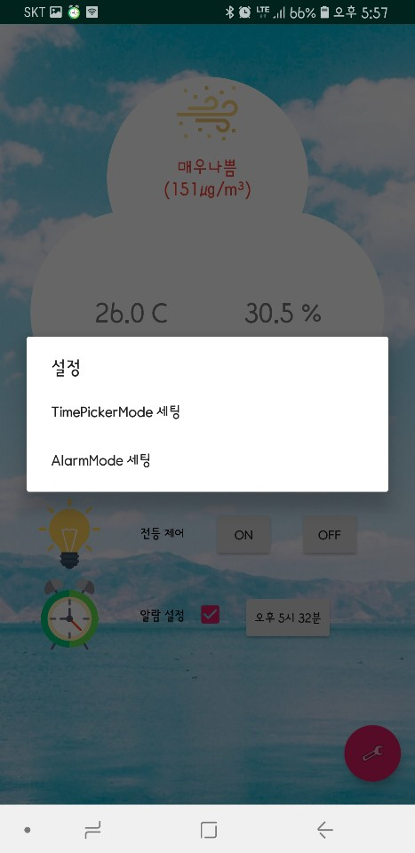
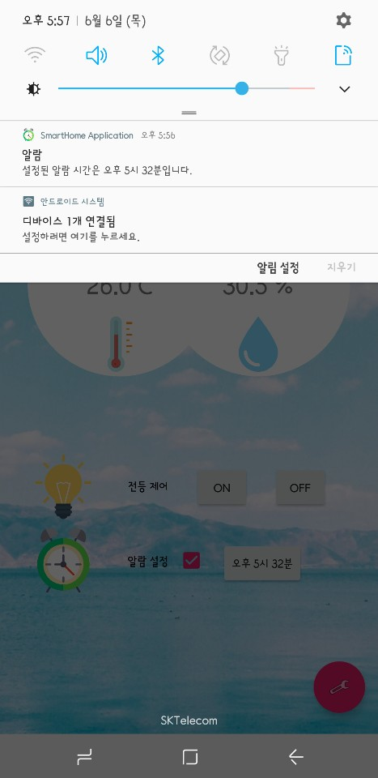
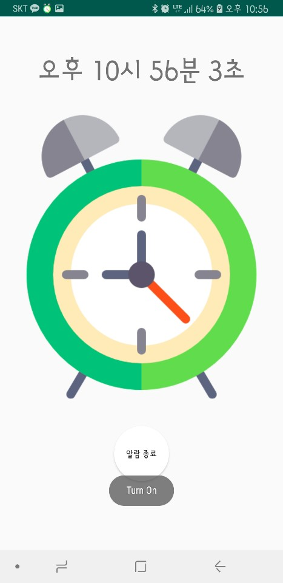

SmartHomeIoT_AVR & SmartHomeIoT_Application
=============================================
# 기능
1. Atmega128에서 온·습도, 미세먼지 데이터 수집 후 블루투스 시리얼통신을 통해 어플리케이션으로 전송, 출력해주는 프로그램  
2. Atmega128에 연결된 서보모터로 전등 스위치 On/Off
3. 어플리케이션의 알람을 이용하여 설정된 알람시간이 됐을 때, 알람이 울림과 동시에 전등 스위치 On
# SmartHomeIoT_AVR
## 1. 개발 환경
- Windows 10 Home 64Bit(1809) / AVR studio 4

## 2. 개발 보드
- Atmega128

## 3. 부품
- 온습도 센서(DHT11) 
- 미세먼지 센서(PMS7003) 
- 서보모터(MG-90S) 
- 블루투스 모듈(HC-06) 

## 4. 구조

## 5. 회로도

-----------------------------
# SmartHomeIoT_Application
## 1. 개발 환경
- Windows 10 Home 64Bit(1809) / Android Studio
- Galaxy A8 Star(android 8.0 Oreo)

## 2. 구성 및 설명
- [InitialActivity.java](https://github.com/psy1064/SmartHomeIoT/blob/master/SmartHomeIoT_Application/app/src/main/java/my/final_project/InitialActivity.java) , [activity_initial.xml](https://github.com/psy1064/SmartHomeIoT/blob/master/SmartHomeIoT_Application/app/src/main/res/layout/activity_initial.xml)
   - 블루투스 연결을 하는 액티비티
   - 블루투스 켜기 : 클릭 시 블루투스 On을 할 수 있는 권한 창 생성
   - Bluetooth Connect : 블루투스 리스트 출력, HC-06(Atmega128에 연결된 블루투스 모듈) 선택 후 연결 성공 시 MainActivity로 이동
   - MainActivity로 이동 : 블루투스 연결 없이 MainActivity로 이동
   
    
- [MainActivity.java](https://github.com/psy1064/SmartHomeIoT/blob/master/SmartHomeIoT_Application/app/src/main/java/my/final_project/MainActivity.java) , [activity_main.xml](https://github.com/psy1064/SmartHomeIoT/blob/master/SmartHomeIoT_Application/app/src/main/res/layout/activity_main.xml)
   - Atmega128로부터 받아온 센서(온.습도, 미세먼지)데이터 출력
   - 미세먼지 데이터는 수치 기준(좋음, 보통, 나쁨, 매우나쁨)에 따라 글자색이 다르게 출력
   - 사진 배경은 시간대에 따라 사진이 변경됨
   - 전등 제어 On, Off 버튼 클릭시 Atmega128에 "On", "Off" 명령 전송
   - 알람 설정 체크 박스 활성화 시 알람 시간 설정 버튼이 생성되고 버튼 클릭 시 TimePickerDialog에 나온 시간을 선택 후 확인을 누르면 설정한 시간이 알람 시간으로 설정 됨
   - 알람 설정 시 Notification 생성
   - 우측 하단 FloatingActionButton 클릭 시 TimePickermode와 Alarmmode를 선택할 수 있는 AlertDialog 생성
   
         
- [AlarmActivity.java](https://github.com/psy1064/SmartHomeIoT/blob/master/SmartHomeIoT_Application/app/src/main/java/my/final_project/AlarmActivity.java) , [activity_alarm.xml](https://github.com/psy1064/SmartHomeIoT/blob/master/SmartHomeIoT_Application/app/src/main/res/layout/activity_alarm.xml)
   - 알람 시간이 되었을 때 실행되는 액티비티
   - 액티비티 상단 실시간 시간 출력
   - 설정한 알람 모드에 따라 음악과 사진 혹은 GIF가 다르게 출력
   - 하단 알람 종료 버튼 클릭 시 액티비티 종료
   
   
- [WeatherActivity.java](https://github.com/psy1064/SmartHomeIoT/blob/master/SmartHomeIoT_Application/app/src/main/java/my/final_project/WeatherActivity.java) , [activity_weather.xml](https://github.com/psy1064/SmartHomeIoT/blob/master/SmartHomeIoT_Application/app/src/main/res/layout/activity_weather.xml)
- [AlarmReceiver.java](https://github.com/psy1064/SmartHomeIoT/blob/master/SmartHomeIoT_Application/app/src/main/java/my/final_project/AlarmReceiver.java)
- [AlarmService.java](https://github.com/psy1064/SmartHomeIoT/blob/master/SmartHomeIoT_Application/app/src/main/java/my/final_project/AlarmService.java)
- [BluetoothService.java](https://github.com/psy1064/SmartHomeIoT/blob/master/SmartHomeIoT_Application/app/src/main/java/my/final_project/BluetoothService.java)
- [DeviceListActivity.java](https://github.com/psy1064/SmartHomeIoT/blob/master/SmartHomeIoT_Application/app/src/main/java/my/final_project/DeviceListActivity.java), [device_list.xml](https://github.com/psy1064/SmartHomeIoT/blob/master/SmartHomeIoT_Application/app/src/main/res/layout/device_list.xml) , [device_name.xml](https://github.com/psy1064/SmartHomeIoT/blob/master/SmartHomeIoT_Application/app/src/main/res/layout/device_name.xml)
- [PushWakeLock.java](https://github.com/psy1064/SmartHomeIoT/blob/master/SmartHomeIoT_Application/app/src/main/java/my/final_project/PushWakeLock.java)
